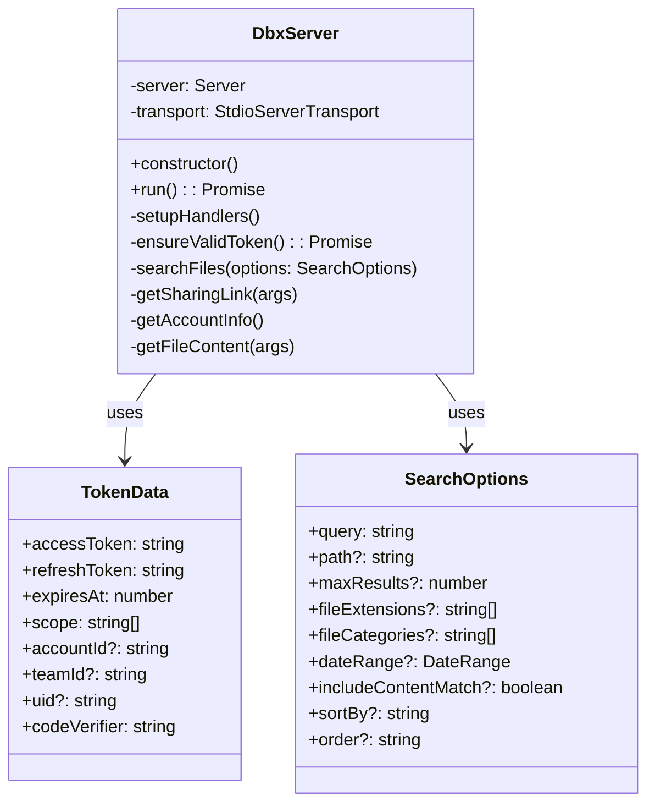
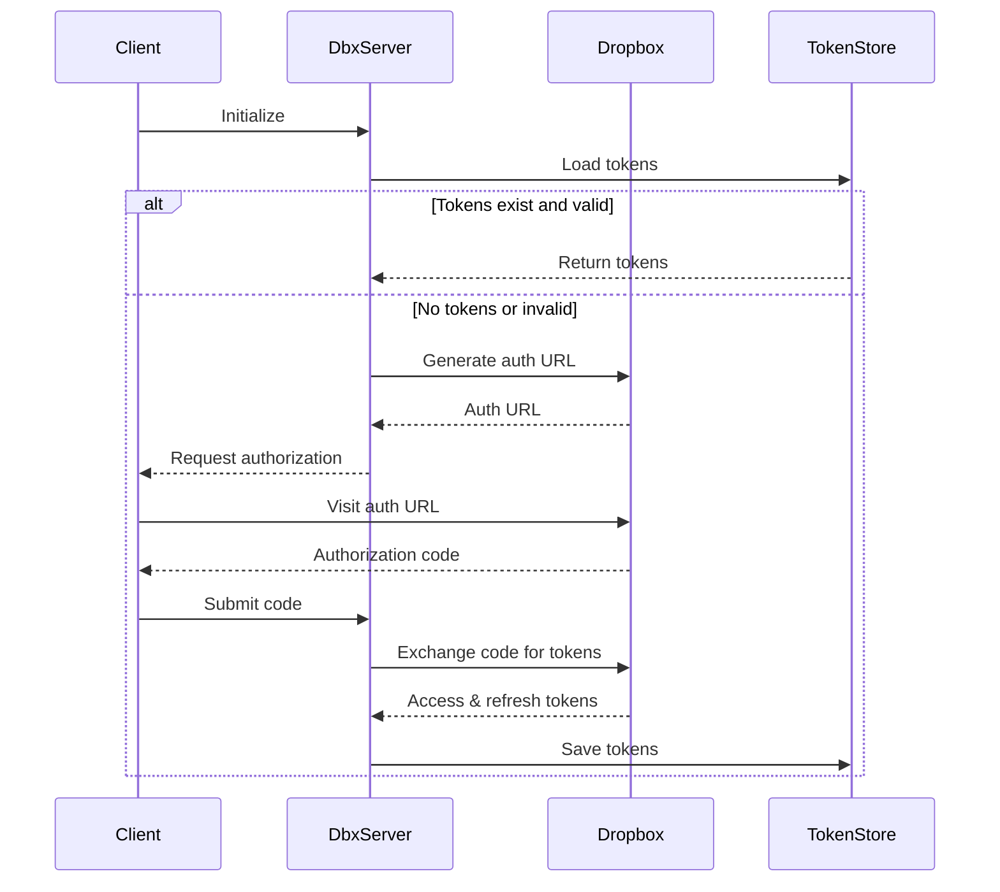
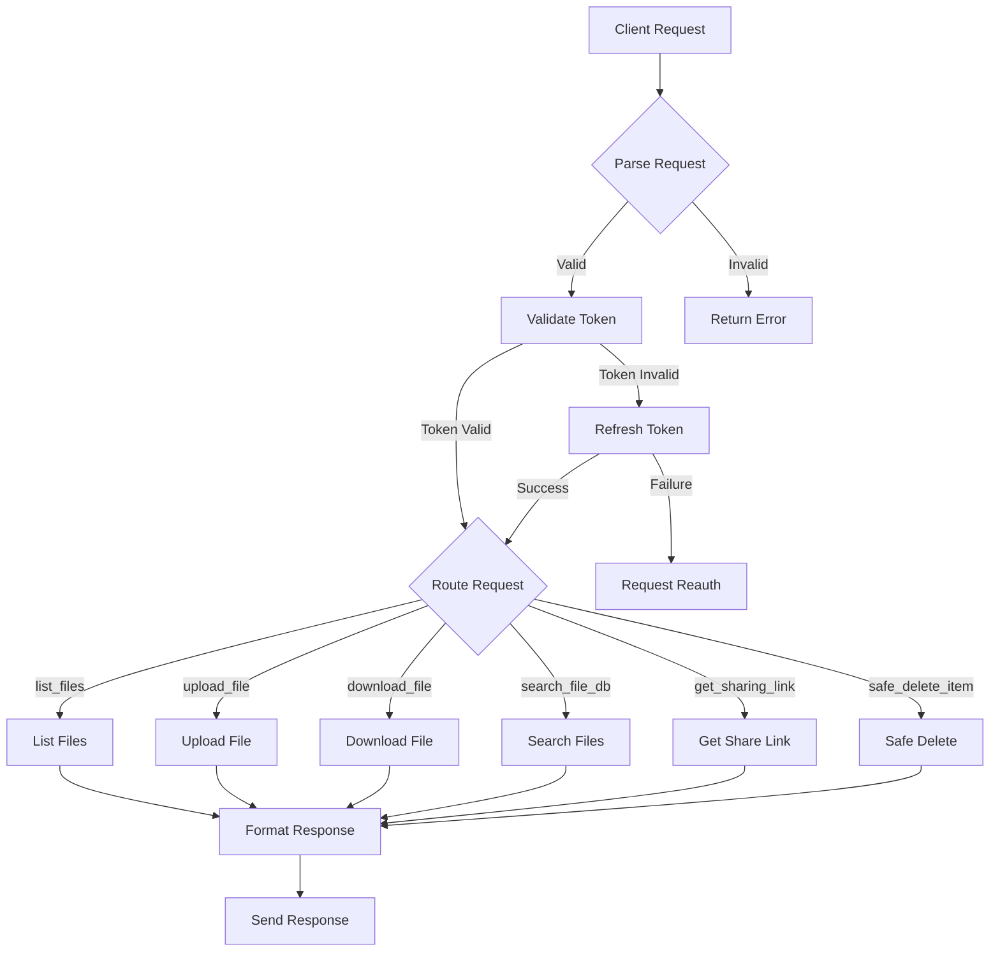
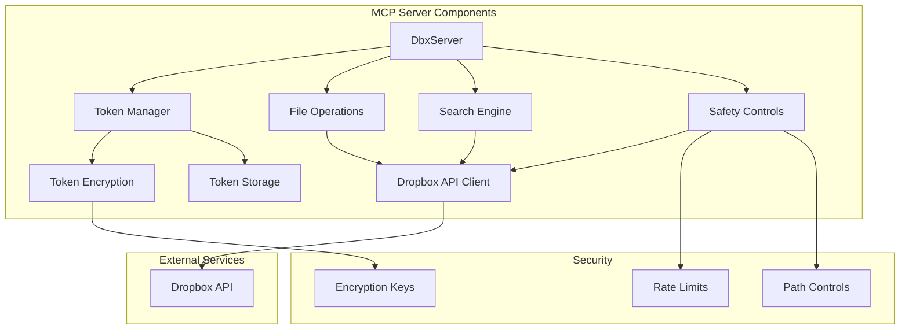
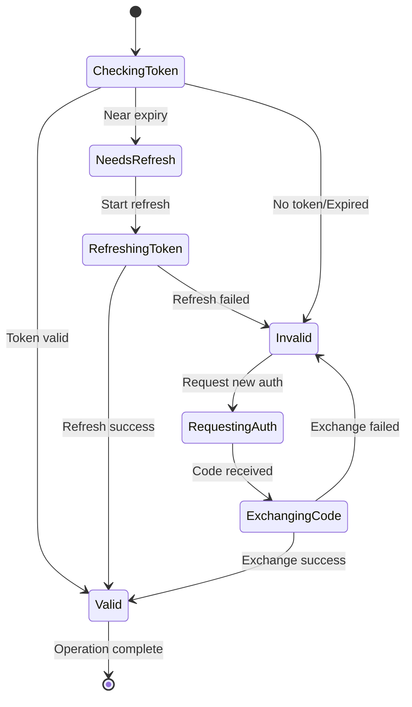

# Dropbox MCP Server

A Model Context Protocol (MCP) server implementation for Dropbox integration, providing secure file operations and management capabilities.

## Overview

The Dropbox MCP Server provides a standardized interface for AI models to interact with Dropbox through the Model Context Protocol. It supports secure file operations, token management, and advanced search capabilities.

## Features

- Secure token management with automatic refresh
- File operations (list, upload, download, search, share, delete)
- Advanced search capabilities with multiple filters
- Safety controls for file operations
- Encrypted token storage
- Comprehensive logging
- MCP protocol compliance

## System Architecture

### Class Diagram


### Authentication Flow


### Request Handling Flow


### Component Architecture


### Token Management States


## Setup and Configuration

1. Install dependencies:
```bash
npm install
```

2. Create a `.env` file with the following configuration:
```env
# Dropbox API credentials
DROPBOX_APP_KEY=your_app_key
DROPBOX_APP_SECRET=your_app_secret
DROPBOX_REDIRECT_URI=http://localhost
TOKEN_ENCRYPTION_KEY=your_encryption_key

# Safety settings
DROPBOX_RECYCLE_BIN_PATH=/Recycle
DROPBOX_MAX_DELETES_PER_DAY=100
DROPBOX_RETENTION_DAYS=30
DROPBOX_ALLOWED_PATHS=/,/Apps
DROPBOX_BLOCKED_PATHS=/System

# Logging settings
LOG_LEVEL=debug
CLIENT_LOG_LEVEL=warn
```

3. Run the setup:
```bash
npm run setup
```

4. Start the server:
```bash
npm start
```

## Available Tools

The server provides the following MCP tools:

- `list_files`: List files and folders in a directory
- `upload_file`: Upload a file to Dropbox
- `download_file`: Download a file from Dropbox
- `search_file_db`: Search files with advanced filters
- `get_sharing_link`: Create a sharing link for a file
- `get_file_metadata`: Get detailed file information
- `safe_delete_item`: Safely delete files with recycling

## Safety Features

- Token encryption at rest
- Automatic token refresh
- Rate limiting for operations
- Path restrictions
- Recycle bin for deletions
- Retention period configuration
- Comprehensive logging

## Development

Build the project:
```bash
npm run build
```

Run tests:
```bash
npm test
```

Run with inspector:
```bash
npm run inspector
```

## Error Handling

The server implements comprehensive error handling:
- Token validation and refresh errors
- API rate limiting
- Path validation
- Operation safety checks
- Network errors
- Authentication errors

## Logging

Logs are stored in the `logs` directory:
- `error.log`: Error-level messages
- `combined.log`: All log levels
- Console output in development mode

## Contributing

1. Fork the repository
2. Create a feature branch
3. Commit your changes
4. Push to the branch
5. Create a Pull Request

## License

This project is licensed under the MIT License - see the LICENSE file for details.
